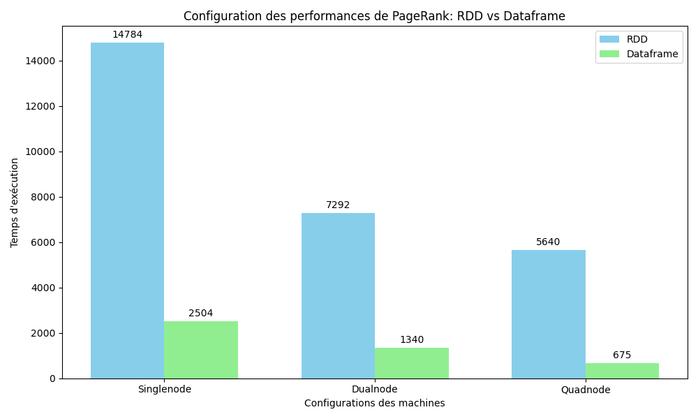

# Benchmark Spark : RDD vs SparkSQL

## Introduction
Ce projet a pour but de faire une analyse comparative entre **PySpark RDD** et **PySpark DataFrames**.
Pour ce faire, nous allons nous appuyer sur l'algorithme du **Page Rank** et comparer les deux implémentations sur le temps d'execution.

## Objectifs
Dans un premier temps, nous avons implémenter l'algorithme du Page Rank en RDD et en DataFrames.
Pour comparer ses deux implémentations, nous allons effectuer des tests sur différents configurations de cluster :
- 1 worker
- 2 worker
- 4 worker

## Données et code source
Le code source utilisé pour ce benchmark est disponible dans ce repo, vous pourrez trouver les exécutables dans les dossiers nommé respectivements *cluster_single_node*, *cluster_dual_node*, *cluster_quad_node*.
Les données sur lesquels nous avons effectuer ce test sont disponible sur *gs://public_lddm_data/*

## Plan d'expérimentation
Nous avons mesuré pour chaque algorithme le temps d'execution des 10 itération qui appliquent la formule du Page Rank aux différentes pages.
Nous avons executé ces algorithmes sur la plateforme GCP en utilisant l'outil Dataproc.
Les machines était dotée de 4 vCPU et de 12g de Mémoire.
La référence google cloud des machines virtuelles utilisée est la suivante : n1-standard-4.
Nous avons essayer tant bien que mal a faire 3 executions par algorithme sur chaques type de cluster cependant par manque de temps et de crédits, certaines experiences n'ont été répliquée que 1 où 2 fois (certaines on aussi été répliquées 3 fois).

## Composition des différents clusters :
Le cluster single est composé de 1 machine faisant office de worker et master.

Le cluster dual est composé de 3 machines, un master et 2 worker.

Le cluster quad est composé de 5 machines, un master et 4 worker.

## Résultats et Analyse
La page avec le plus haut Page Rank de nos éxecution était [http://dbpedia.org/resource/Living_people](http://dbpedia.org/resource/Living_people) avec un page rank de 19320.8 pour l'algo SQL et de 86062.5 pour le RDD.
Cette différence de page rank s'explique par le fait que notre algorithme SQL donnait en sortie le page rank de l'itération numéro une.

Voici le graphique de comparaison entre RDD et DataFrame :

*Les données récoltées lors de ces experimentations sont disponibles dans le dossier ResultBenchmark*

### Discutions
Les résultats montrent que dataframe est significativement plus performant de RDD.
Cela est du au fait que pour les dataframes, le calcul passe par un optimiseur.
Il est nécessaire aussi de se questionner sur les optimisations a faire côté de l'algorithme rdd, une optimisation a commencé a être envisagée mais nous n'avons pas eu le temps de la finir.
On pense que nos résultats sont aussi imprécis puisque l'algorithme Spark SQL avait un soucis dont on c'est aperçu trop tard.
Avec une version corrigée de l'algorithme SQL, exécutée sur un cluster avec 1 machines, le temps d'éxecution se rapproche de celui du RDD mais reste néamoins plus rapide.

## Reproductibilité
Nos experiences sont reproductibles. Vous retrouverez dans le git, un dossier spécifique à l'éxecution des 2 algorithmes sur chaques cluster (1, 2 et 4 workers).
Dans les dossier vous retrouverez un script bash nommé avec un préfixe "run".
Veuillez spécifier vos propres informations (bucket, projectID, ...) si vous souhaitez réutiliser le script sur votre espace GCP.

## Crédits
Ce travail à été effectuer par **Henri COSSAIS** et **Mattéo Deransart**, étudiants en Master 2 d'Architecture Logicielle (ALMA) à Nantes Université
